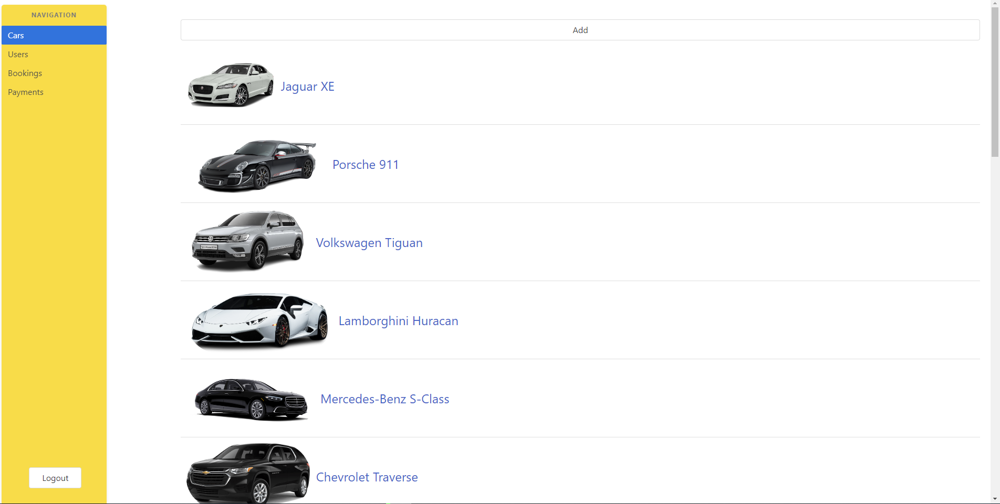
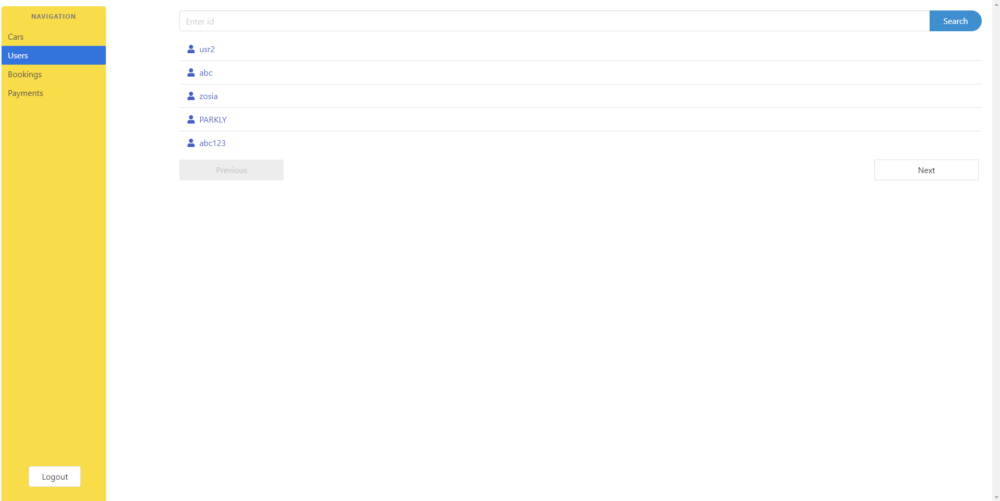
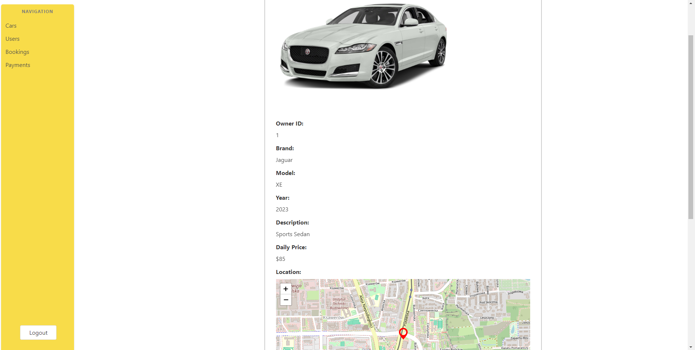
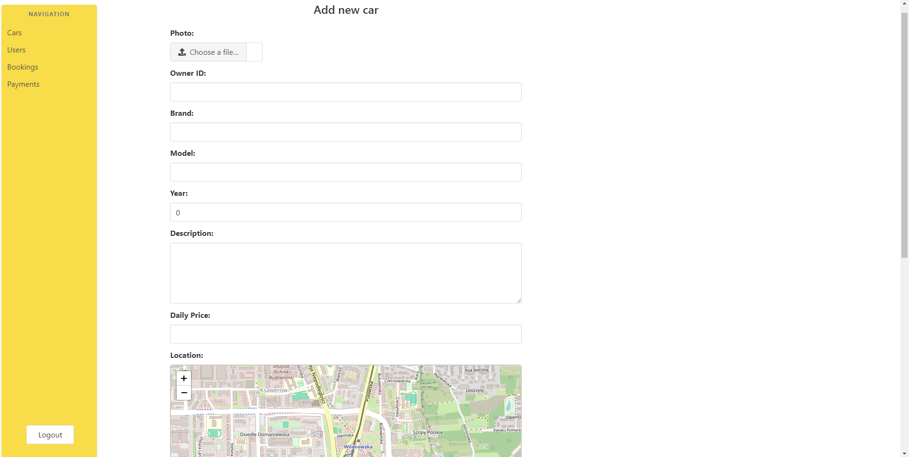

# Carly Administrator Panel
Simple administrator panel for managing Carly backend written in React.

It lists all cars, users, bookings and payments in the system and let's you manage them.

## Features

### Listing

### Viewing details 

### Editing details

You can edit/add all data including images with an upload module and location using map picker.